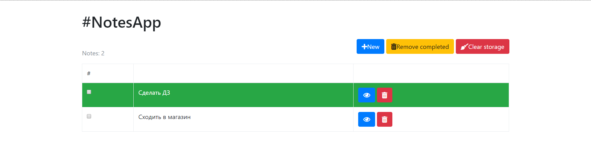

# NotesApp. Тест-кейсы

### 1. Добавление заметок

**Описание:**

Добавление заметок разных цветов.

**Действия**

  1. Открыть приложение NotesApp.
  2. Нажать на кнопку New.
  3. В поле 'Note title' ввести строку 'Сделать ДЗ'.
  4. В поле 'Note' ввести строку 'Сделать ДЗ по математике и физике'.
  5. Нажать на radio button 'Green'
  6. Нажать на кнопку 'Save'.
  7. Нажать на кнопку New.
  8. В поле 'Note title' ввести строку 'Сходить в магазин'.
  9. В поле 'Note' ввести строку 'Купить молоко и хлеб'.
  10. Нажать на radio button 'White'
  11. Нажать на кнопку 'Save'.
  
**Ожидаемый результат**

В таблице с заметками должны появиться 2 заметки. Первая - зеленого цвета с надписью 'Сделать ДЗ'. 
Вторая - белого цвета с надписью 'Сходить в магазин'
Над таблицей с заметками должна появится надпись 'Notes: 2'.

**Полученный результат**
Полученный результат соответствует ожидаемому.

### 1. Удаление заметок

**Описание:**

Удаление всех заметок при помощи кнопки Clear Storage.

**Действия**

  1. Открыть приложение NotesApp.
  2. Нажать на кнопку New.
  3. В поле 'Note title' ввести строку 'Убраться дома'.
  4. В поле 'Note' ввести строку 'Вымыть пол и окна'.
  5. Нажать на radio button 'Green'
  6. Нажать на кнопку 'Save'.
  7. Нажать на кнопку Clear Storage.

**Ожидаемый результат**

Таблица с заметками должна быть пуста. Над таблицей должна появиться надпись 'You have no notes :('.

**Полученный результат**

Полученный результат соответствует ожидаемому.

