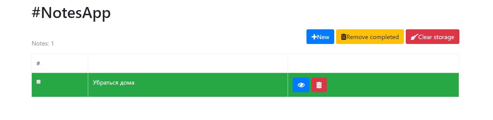
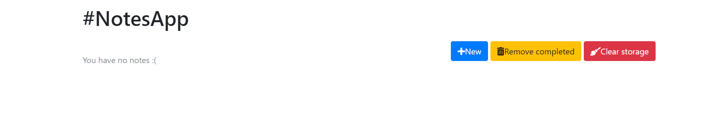
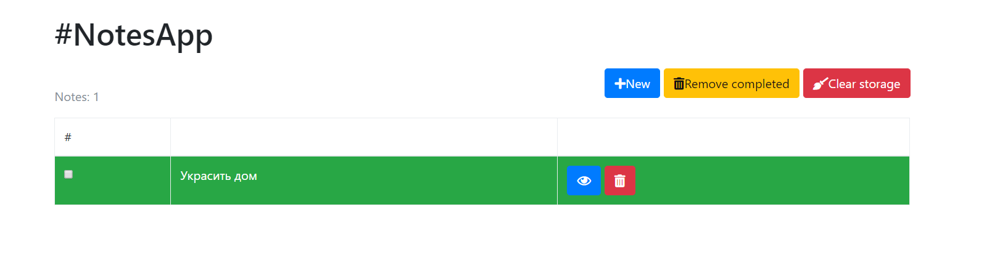
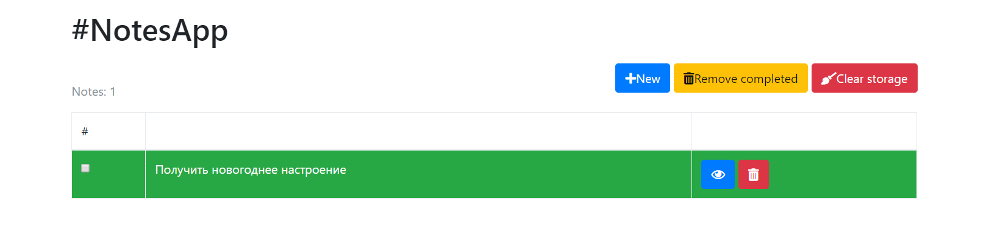

# NotesApp. Тест-кейсы

### 1. Добавление заметок

**Описание:**

Добавление заметок разных цветов.

**Действия**

1. Открыть приложение NotesApp.
2. Нажать на кнопку New.
3. В поле 'Note title' ввести строку 'Сделать ДЗ'.
4. В поле 'Note' ввести строку 'Сделать ДЗ по математике и физике'.
5. Нажать на radio button 'Green'
6. Нажать на кнопку 'Save'.
7. Нажать на кнопку New.
8. В поле 'Note title' ввести строку 'Сходить в магазин'.
9. В поле 'Note' ввести строку 'Купить молоко и хлеб'.
10. Нажать на radio button 'White'
11. Нажать на кнопку 'Save'.
  
**Ожидаемый результат**

В таблице с заметками должны появиться 2 заметки. Первая - зеленого цвета с надписью 'Сделать ДЗ'. 
Вторая - белого цвета с надписью 'Сходить в магазин'
Над таблицей с заметками должна появится надпись 'Notes: 2'.

**Полученный результат**

Полученный результат соответствует ожидаемому.

### 2. Удаление заметок

**Описание:**

Удаление всех заметок при помощи кнопки Clear Storage.

**Действия**

1. Открыть приложение NotesApp.
2. Нажать на кнопку New.
3. В поле 'Note title' ввести строку 'Убраться дома'.
4. В поле 'Note' ввести строку 'Вымыть пол и окна'.
5. Нажать на radio button 'Green'
6. Нажать на кнопку 'Save'.
7. Нажать на кнопку Clear Storage.

**Ожидаемый результат**

Таблица с заметками должна быть пуста. Над таблицей должна появиться надпись 'You have no notes :('.

**Полученный результат**

Полученный результат соответствует ожидаемому.
Результат после выполнения 6 пункта:

Итоговый результат:

### 1. Изменение текста заметки.

**Описание:**

Изменение заголовка и текста уже записанной заметки.

**Действия**

1. Открыть приложение NotesApp.
2. Нажать на кнопку New.
3. В поле 'Note title' ввести строку 'Украсить дом'.
4. В поле 'Note' ввести строку 'Поставить елку, повесить гирлянду на дом'.
5. Нажать на radio button 'Green'
6. Нажать на кнопку 'Save'.
7. Нажать на синюю кнопку справа от заметки, с иконкой глаза.
8. В поле 'Note title' ввести строку 'Получить новогоднее настроение'.
9. В поле 'Note' ввести строку 'Поставить елку, повесить гирлянду на дом. Купить мандарины, разжечь камин'.
10. Нажать на кнопку 'Save'.

**Ожидаемый результат**

В таблице с заметками должна быть единственная заметка зеленого цвета с заголовком 'Получить новогоднее настроение'.
Над таблицей с заметками должна появится надпись 'Notes: 1'.

**Полученный результат**

Полученный результат соответствует ожидаемому.
Результат после выполнения 6 пункта:

Итоговый результат:

